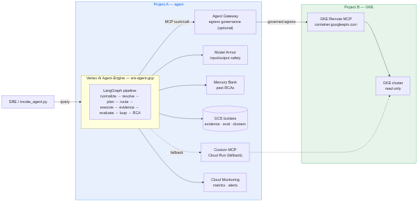

# Architecture

> **Status: SUPERSEDED / HISTORICAL** · **Archived:** 2026-08-20
> **Current replacement:** [`../docs/architecture/system-overview.md`](../docs/architecture/system-overview.md)
> and the rest of `../docs/architecture/` (17 pages).
>
> Accurate as of 2026-07-12, kept as history. Two things below are **no longer true**:
> the claim that the agent "filters I/O through Model Armor" (Model Armor is templated but
> filters nothing in the live deployment — see
> [`../docs/management/risks-and-limitations.md`](../docs/management/risks-and-limitations.md)),
> and the gateway-attach mechanism, which moved to Terraform-native `agent_gateway_config`
> in PR #93 on 2026-08-10.



*(Diagram source: `SUPERSEDED_2026-08-20_architecture-diagram.mmd`.)*

## Overview

The agent is a LangGraph investigator deployed on **Vertex AI Agent Engine** in
**Project A**. It reasons with **Gemini**, remembers past RCAs in a **Memory
Bank**, filters I/O through **Model Armor**, and investigates Kubernetes
incidents in a GKE cluster in **Project B** — read-only — via the Google-managed
**GKE Remote MCP** endpoint (with an optional custom Cloud Run MCP fallback).
When enabled, an **Agent Gateway** governs all of the agent's egress.

The investigation runs as a 9-node LangGraph pipeline:

```
incident → input_normalizer → context_resolver → task_planner → mcp_router
         → tool_executor → evidence_extractor → task_evaluator → loop_controller
         → rca_builder → RCA report
```

`loop_controller` cycles back to `task_planner` until it has enough evidence,
hits a step limit, or detects it is stuck; `rca_builder` then writes the report,
persists evidence to GCS, and stores a memory.

## Component → project map

| Component | Project | Terraform |
|---|---|---|
| Reasoning engine (agent) + Memory Bank | A | `iac/agent/agent_engine.tf` |
| Agent Gateway + PSC attachment + firewall + authz | A | `iac/agent/agent_gateway.tf` |
| Model Armor template | A | `iac/agent/model_armor.tf` |
| Evidence / eval / cluster-config buckets | A | `iac/agent/buckets.tf` |
| Custom Cloud Run MCP (optional fallback) | A | `iac/agent/cloudrun_mcp.tf` |
| Monitoring (metrics, alerts) | A | `iac/agent/monitoring.tf` |
| Runtime + platform IAM | A | `iac/agent/iam.tf`, `iap_egressor.tf` |
| CI/CD WIF deployer | A | `iac/agent/oidc.tf` |
| GKE cluster (optional) | B | `iac/gke-access/gke.tf` |
| Cross-project read-only IAM | B | `iac/gke-access/crossproject_iam.tf` |

## Environment variables (single source of truth)

The reasoning engine's environment is defined once, in `iac/agent/agent_engine.tf`
(`local.agent_env`). `agent/.env.example` mirrors these names for local runs.

| Variable | Set by | Purpose |
|---|---|---|
| `PROJECT_ID` | engine env | Project A id |
| `REGION` | engine env | Region |
| `GEMINI_MODEL` | engine env | Model (default `gemini-2.5-flash`) |
| `MODEL_ARMOR_TEMPLATE` | engine env | Model Armor template name |
| `EVAL_BUCKET` | engine env | Eval datasets/results bucket (`gs://…`) |
| `EVIDENCE_BUCKET` | engine env | Evidence/run-output bucket (no `gs://`) |
| `CLUSTER_CONFIG_BUCKET` | engine env | Bucket holding `clusters.json` |
| `MEMORY_BANK_RESOURCE` | engine env | Memory Bank reasoning-engine resource path |
| `GOOGLE_CLOUD_AGENT_ENGINE_ENABLE_TELEMETRY` | engine env | `"true"` |
| `GOOGLE_API_PREVENT_AGENT_TOKEN_SHARING_FOR_GCP_SERVICES` | engine env (gateway on) | `"false"` — lets Agent Identity tokens work with the SDKs |
| `K8S_MCP_URL` | engine env (custom MCP on) | Cloud Run MCP fallback URL |
| `GKE_REMOTE_MCP_URL` | agent default | Fixed `https://container.googleapis.com/mcp/read-only` |
| `GEMINI_PRICE_INPUT` / `GEMINI_PRICE_OUTPUT` | agent default | Per-1M token pricing for cost telemetry |
| `CLUSTER_1_REGION` | agent default | Fallback region if a cluster entry omits one |

Local-only helpers (`agent/.env`): `AGENT_RESOURCE_NAME`, `REASONING_ENGINE_ID`
(used by `invoke_agent.py`), generated by `scripts/init-env.sh`.
