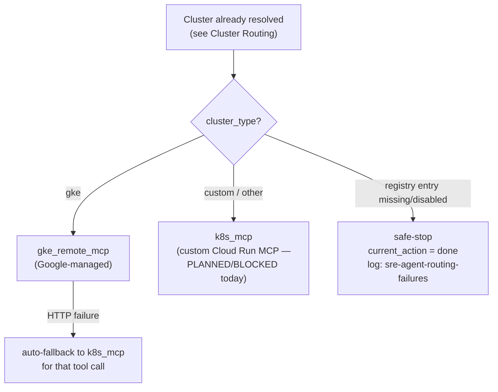

# Dynamic MCP Routing

> **Implementation Status:** IMPLEMENTED (deterministic source selection); custom-MCP target itself is PLANNED/BLOCKED — see [MCP Architecture](mcp-architecture.md)
> **Last Verified:** 2026-08-08 — `agent/nodes/mcp_router.py:110-136`
> **Source of Truth:** `agent/nodes/mcp_router.py:110-136`
> **Owner:** SRE Agent platform team.

This page is about **which MCP source** the agent uses (`gke_remote_mcp` vs. the custom MCP). It's a separate question from **which cluster** the incident is about — see [Cluster Routing](cluster-routing.md) for that.

## Today's routing rule

```
Cluster type = "gke"   → gke_remote_mcp   (Google-managed)
Cluster type = anything else → k8s_mcp    (custom Cloud Run MCP — currently PLANNED/BLOCKED, see MCP Architecture)
```

There is currently no Elastic MCP, Prometheus MCP, or any other source registered — those are **PLANNED**, future work, following the pattern in [Adding a New MCP Server](../runbooks/add-mcp-server.md).

## What information is used to select the source

The `cluster_type` field on the already-resolved cluster's registry entry (see [Cluster Routing](cluster-routing.md) for how the cluster itself gets identified) — `agent/nodes/mcp_router.py:110-136`, labeled in the code itself as "Phase 1: deterministic MCP source selection (no LLM tokens)."

## Is routing deterministic or model-driven?

**100% deterministic code, no LLM call.** This is Phase 1 of `mcp_router`. (Phase 2 of the same node — picking which specific *tool* to call, once the source is already locked in — does involve an LLM call, but that's a different decision. See [Tool Selection](tool-selection.md).)

## Where routing logic is implemented

`agent/nodes/mcp_router.py:110-136` (source selection) and `agent/mcp_client.py:645-775` (`resolve_cluster_routing()`, the cluster-identity chain that determines *which* cluster and therefore which registry entry's `cluster_type` gets used).

## What happens if two MCP servers can answer the same question?

Doesn't happen by design — routing is 1:1 per cluster (one `cluster_type` → exactly one source), not a "pick the best of several candidates" decision. If GKE Remote MCP fails at runtime, the code auto-falls-back to the custom MCP for that specific tool call (`_map_to_custom_tool()`, `agent/mcp_client.py:322-332`) — this is a failure-recovery mechanism, not routing ambiguity.

## How do we prevent incorrect routing?

By keeping the decision deterministic and code-owned rather than model-guessed — see the "who decides" table in [Investigation Loop](investigation-loop.md). The model never picks the source; it only picks a tool from within whichever source the code already selected.

## What happens if MCP routing cannot determine a source?

If the resolved cluster's registry entry is missing or disabled by the time `mcp_router` runs (the registry has a 5-minute TTL cache, so it's possible for state to go stale between `context_resolver` and `mcp_router`), the node safe-stops (`current_action={"tool":"done"}`) and logs a structured event to `sre-agent-routing-failures` (`agent/nodes/mcp_router.py:66-92,121-131`). This is explicitly a "defense-in-depth" check — the primary gate is [Cluster Routing](cluster-routing.md)'s own safe-stop.

## How is routing tested?

Via the golden evaluation cases (see [Evaluation](evaluation.md)) — several cases exercise ambiguous-routing and MCP-gateway-failure scenarios by name (`ambiguous-routing-001`, `mcp-gateway-failure-001`).

## What routing metrics are collected?

`sre_agent/routing_failures` (log-based metric, scoped correctly by `logName`) and the `SRE Agent — Routing Failures` alert (fires on any occurrence in a 5-minute window). See [Observability](../operations/observability.md).

## Routing decision diagram



---

**Related pages:** [Cluster Routing](cluster-routing.md) · [MCP Architecture](mcp-architecture.md) · [Tool Selection](tool-selection.md)
