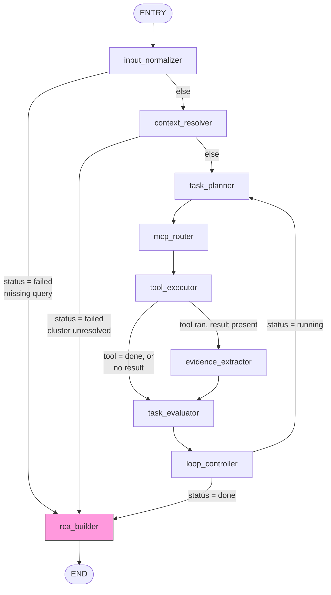

# LangGraph Workflow

> **Implementation Status:** IMPLEMENTED
> **Last Verified:** 2026-08-08 — `agent/graph.py`, all files in `agent/nodes/`
> **Source of Truth:** `agent/graph.py:49-100`
> **Owner:** SRE Agent platform team.

## What LangGraph is (in plain terms)

LangGraph is a Python library for building an AI workflow as an explicit **state machine**: a set of named steps ("nodes"), fixed or conditional paths between them ("edges"), and one shared data structure ("state") that every node can read from and write to. The key thing that makes this different from just calling an LLM in a loop yourself: the *shape* of the workflow — which steps exist, and which steps can follow which — is defined in code and cannot be changed by the model at runtime. The model can influence *which conditional branch fires*, but it cannot invent a new step or skip the graph structure.

**Why this matters for an SRE agent specifically**: it means the LLM cannot, for example, decide to skip evidence-gathering and jump straight to writing an RCA, or decide to call an unapproved tool outside the normal flow. The graph structure is the safety rail; the LLM operates inside it.

## Our graph, node by node

Defined in `agent/graph.py:49-100`. Entry point: `input_normalizer`.

| Node | Purpose | Reads (state) | Writes (state) | LLM call? | Tools | Failure/stop behavior |
|---|---|---|---|---|---|---|
| **`input_normalizer`** `agent/nodes/input_normalizer.py:15-75` | Parses the free-text incident query into structured fields | `incident_envelope` | `resolved_context` (incident_type, namespace, pod, cluster_hint, cluster_guess, project_hint, environment_hint, deployment, severity) | Yes, 1 call, max 512 tokens | none | If `user_query` is empty: no LLM call, sets `investigation.status="failed"` and routes straight to `rca_builder` |
| **`context_resolver`** `agent/nodes/context_resolver.py:38-133` | Deterministically resolves the target cluster and picks the primary/fallback MCP source | `resolved_context` | `resolved_context` (cluster_name, cluster_region, project_id, cluster_routing_method/reason, mcp_source, mcp_fallback) | No | none | If the cluster can't be confidently resolved: safe-stop, `investigation.status="failed"`, `loop_exit_reason="cluster_unresolved"`, routes straight to `rca_builder` — see [Cluster Routing](cluster-routing.md) |
| **`task_planner`** `agent/nodes/task_planner.py:24-71` | LLM decides the next investigation gap/plan given evidence so far | `investigation`, `resolved_context`, `evidence_store`, `working_theory` | `investigation.task_plan`, `investigation.primary_gap` | Yes, 1 call, max 300 tokens | none | Falls back to a default plan string if the LLM returns nothing usable |
| **`mcp_router`** `agent/nodes/mcp_router.py:96-252` | Phase 1 (code, no LLM): pick the MCP source for this cluster. Phase 2 (LLM): pick one tool + arguments from that source's allowlist | `resolved_context`, `investigation`, `tool_history` | `selected_mcp`, `current_action` | Yes (Phase 2 only), 1 call, max 300 tokens | Selects from `GKE_REMOTE_TOOLS` or `CUSTOM_K8S_TOOLS` allowlists | Safe-stops to `current_action={"tool":"done"}` (does not fail the whole investigation) if the cluster's registry entry is missing/disabled, the model picked a tool outside the allowlist, or the exact same (tool, args) already ran successfully — see [MCP Architecture](mcp-architecture.md) |
| **`tool_executor`** `agent/nodes/tool_executor.py:18-112` | Executes the one tool call `mcp_router` selected | `current_action`, `selected_mcp`, `resolved_context` | `tool_history` (compact record only), `latest_tool_result` (raw, transient) | No (this is a network call, not an LLM call) | The single tool `mcp_router` chose | On failure: logs a structured event to a dedicated `sre-agent-tool-failures` log; raw output never enters graph state either way — by design |
| **`evidence_extractor`** `agent/nodes/evidence_extractor.py:25-169` | Writes sanitized raw evidence to GCS, extracts compressed facts via LLM | `latest_tool_result`, `resolved_context` | `evidence_ids`, `evidence_store` | Yes, only on a successful tool call, max 700 tokens | none directly | On a failed tool call: writes a synthetic error evidence record instead, no LLM call. On a GCS write failure: marks `gcs_write_failed=True` but the investigation continues |
| **`task_evaluator`** `agent/nodes/task_evaluator.py:44-122` | LLM judges whether there's enough evidence to stop looping; deterministic completeness score computed every call | `investigation`, `evidence_store`, `tool_history` | `investigation.enough_evidence`, `investigation.completeness`, `working_theory` | Yes (unless a hard gate below skips it), max 400 tokens | none | Two gates BEFORE any LLM call: zero evidence collected so far forces `enough_evidence=False`; fewer than `min_steps` (2) iterations done also forces `False` |
| **`loop_controller`** `agent/nodes/loop_controller.py:97-179` | Deterministic, no-LLM decision on whether to keep looping or stop | `investigation`, `tool_history`, `evidence_ids` | `investigation.current_step` (incremented), `investigation.status`, `investigation.loop_exit_reason` | No | none | See [Investigation Loop](investigation-loop.md) for the full list of exit reasons and exact numeric limits |
| **`rca_builder`** `agent/nodes/rca_builder.py:309-500` | Builds the final RCA: LLM proposes claims/hypotheses/root cause, then code deterministically scores confidence and writes the audit log | `resolved_context`, `investigation`, `evidence_store`, `tool_history` | `final_summary`, `investigation.status="done"` | Yes, 1 call, max 1536 tokens (largest budget of any node) | none | If zero evidence was collected: overrides the LLM's output with a hard-coded "no evidence" root cause — this node always runs, it's the graph's only terminal path before `END` |

**Note on LLM usage**: every node makes at most one LLM call per invocation. There is no multi-step "agentic tool loop" *inside* a single node — the looping happens at the graph level (`loop_controller` routes back to `task_planner`), not inside any node's own logic.

## Complete edge / routing map

Two **safe-stop shortcuts** bypass the entire tool-calling loop: a missing query (`input_normalizer`) and an unresolvable cluster (`context_resolver`) both route straight to `rca_builder`, skipping `task_planner`/`mcp_router`/`tool_executor`/`evidence_extractor`/`task_evaluator`/`loop_controller` entirely. This is deliberate — the agent should never guess its way into a fake investigation.

## The investigation cycle

The loop is: `task_planner` → `mcp_router` → `tool_executor` → (`evidence_extractor` if a tool ran) → `task_evaluator` → `loop_controller` → back to `task_planner`, repeat. This continues until `loop_controller` decides to stop — see [Investigation Loop](investigation-loop.md) for exactly what stops it.

## Two safety nets worth knowing about (they are different things)

1. **LangGraph's own `recursion_limit=60`** (`agent/main.py:423,443`) — a hard cap on total graph steps, set when the graph is invoked. This is generous headroom (each loop iteration touches ~4-5 nodes), not the operative limit day-to-day.
2. **`investigation.max_steps = 5`** — the real, intentional cap on investigation *loop iterations*, enforced by `loop_controller`. This is the number that actually governs "how many times will the agent check something before giving up." See [Investigation Loop](investigation-loop.md).

## A dead code path worth knowing about

`mcp_router`'s Phase 1 (deterministic MCP-source selection) has **no LLM call** — but the prompts file (`agent/prompts.py:53-69`) still contains an `MCP_ROUTER_PHASE1_SYSTEM/USER` prompt pair, explicitly commented "kept for reference, not used." **STATUS: DEPRECATED / unused.** Don't be confused if you see this prompt while reading the code — it is not part of the live flow.

Similarly, the `task_evaluator`'s prompt asks the LLM for a `loop_exit_reason` field, but `task_evaluator.py` never reads that field back out of the LLM's response (`agent/nodes/task_evaluator.py:98-100` only extracts `enough_evidence`, `working_theory`, `evidence_gaps`). **STATUS: PARTIALLY IMPLEMENTED / dead field** — `loop_exit_reason` is entirely decided by `loop_controller`, not the model.

---

**Related pages:** [Investigation Loop](investigation-loop.md) · [Context and State](context-and-state.md) · [Tool Selection](tool-selection.md)
