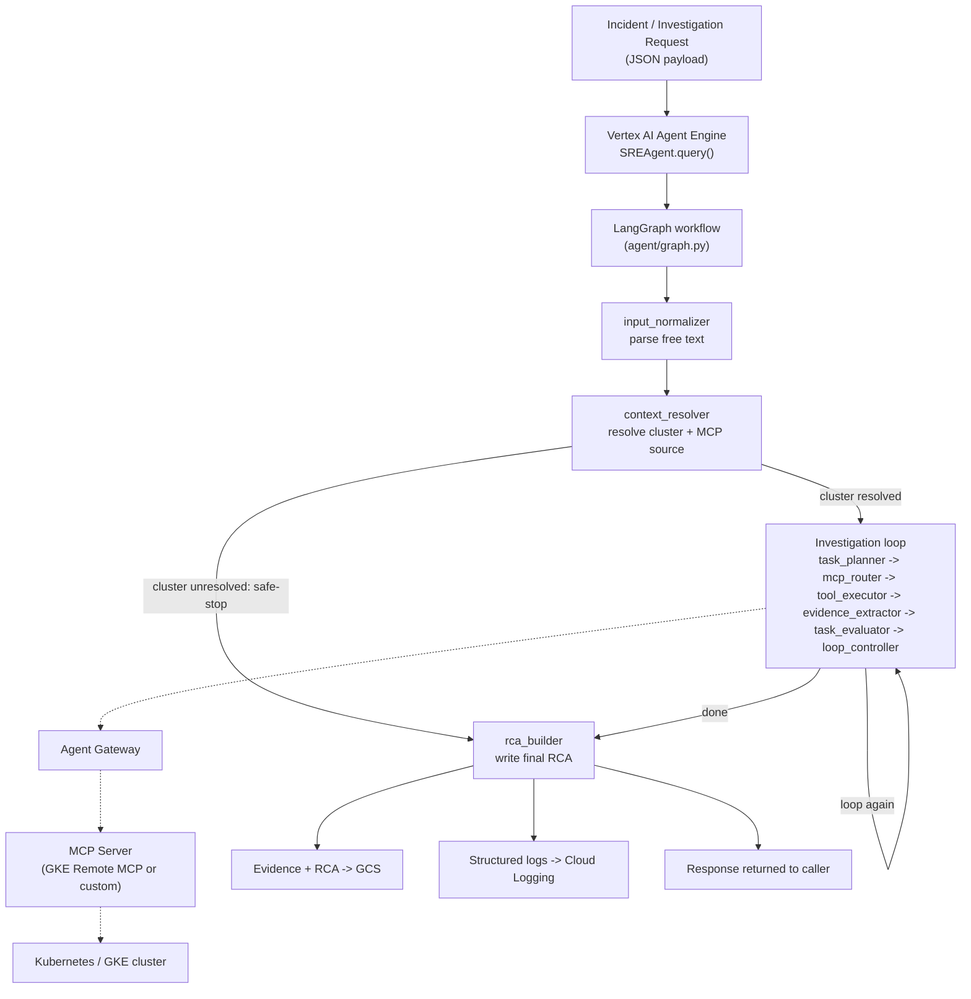

# System Overview

> **Implementation Status:** IMPLEMENTED (core investigation path); see inline status markers below for specific sub-claims.
> **Last Verified:** 2026-08-08, by direct code/Terraform inspection (not from design docs).
> **Source of Truth:** `~/projects/sre-agent-gateway` (GCP project `sreagent-t2-demo`).
> **Owner:** SRE Agent platform team.

This page is the entry point. Read it first. It answers "what is this thing" in plain language, then points you to the deeper pages for each part.

---

## What the SRE AI Agent is

It is a piece of software that investigates Kubernetes incidents automatically and writes a root-cause-analysis (RCA) report. You give it a short description of a problem ("Pod imagepull-pod is in ImagePullBackOff"), and it goes and looks at the cluster itself — pod status, events, logs, deployment config — the same way a human SRE would when paged, except it does this by calling a fixed set of **read-only** tools and reasoning over the results with a large language model (LLM, specifically Google's Gemini).

It is not a chatbot. It is not a general-purpose assistant. It is a single-purpose investigation loop: given an incident, gather evidence, decide when there's enough evidence, write an RCA, stop.

## What problem it solves

When an alert fires, the first 10-20 minutes of an incident are usually spent on the same repetitive steps: check the pod, check the events, check recent logs, check the deployment spec, check if this happened before. This is mechanical, but it still takes a human's attention. The agent automates exactly that mechanical first pass, so a human SRE opens the incident already looking at a structured summary with the evidence attached, instead of starting from zero.

## What it does

1. Receives an incident description (a JSON payload: query text, namespace, pod, cluster, severity).
2. Works out which Kubernetes cluster and namespace the incident is actually about.
3. Calls a small number of read-only Kubernetes tools (list pods, get events, get logs, describe resource, etc.) in a loop, deciding what to check next based on what it's already found.
4. Stops when it has enough evidence, or hits a safety limit (see [Investigation Loop](investigation-loop.md)).
5. Writes a structured RCA: incident summary, root cause, supporting evidence, a confidence assessment, and suggested remediation.
6. Returns that RCA to whoever called it, and stores a durable copy in Cloud Storage.

## What it intentionally does NOT do

This is as important as what it does do — read this list carefully, it will come up in every governance/security conversation about this system.

- **It never writes to Kubernetes.** No pod deletion, no scaling, no config changes, no `exec`, no `port-forward`. This is enforced in four independent places — see [Authorization and Permissions](../governance/security.md#kubernetes-access-is-read-only) for the full evidence chain (an explicit tool allowlist, a hard-coded verb blocklist, only read-verb Kubernetes-client calls in the underlying tool code, and a CI regression test that fails the build if a mutating call is ever added).
- **It never reads Kubernetes Secrets.** No secret-reading tool exists in its tool set, and RBAC (where applied) uses the built-in `view` ClusterRole, which itself excludes Secrets.
- **It does not remediate anything automatically.** It suggests remediation in the RCA text; a human decides whether and how to act on it.
- **It does not learn or update its own code.** Confidence scoring and evaluation are deterministic application code, not the model "getting smarter" — see [Confidence Scoring](confidence.md).
- **It does not have a persistent conversation.** Each investigation is a fresh run, isolated by a `run_id` — see [Context and State](context-and-state.md#how-we-prevent-one-investigation-from-contaminating-another).

## Where it runs

The agent's code runs as a **Vertex AI Agent Engine (Reasoning Engine)** deployment in GCP project `sreagent-t2-demo`. This is a Google-managed serverless container platform purpose-built for agent workloads — see [Agent Engine](agent-engine.md) for exactly what Google manages vs. what we control.

## How an investigation starts

Something (a human running a CLI script, or eventually an automated alert pipeline) calls the agent's `query()` entrypoint with a JSON payload describing the incident. Today, live testing is done via `invoke_agent.py`, a CLI script that sends one of several pre-defined test scenarios (e.g. `imagepull`, `crashloop`) to the deployed engine. **STATUS: There is currently no live automated PagerDuty-to-agent trigger wired up** — that integration is PLANNED, not implemented (see [PagerDuty gap](../governance/reliability.md)).

## How an investigation ends

One of two ways:
- **Normal completion**: the investigation loop decides it has enough evidence (or hits a safety limit — max steps, timeout, token budget, or a few other deterministic stop conditions), and the final node (`rca_builder`) writes the RCA.
- **Early safe-stop**: if the incident description is missing a query, or the target cluster can't be confidently identified, the agent skips the whole investigation loop and goes straight to writing an RCA that says "I could not determine X" — it never guesses a cluster or fabricates a root cause. See [Investigation Loop](investigation-loop.md#safe-stops).

## What gets returned to the engineer

A structured response containing: overall status, the RCA (both a machine-readable object and a human-readable text report), a plain-English executive summary, a confidence assessment, the full evidence trail (with evidence IDs), which tools were called and which failed, token/cost/latency numbers, and whether human review is required.

## What gets stored

- **Raw tool output** — sanitized (secrets/PII redacted) and written to a Cloud Storage evidence bucket, keyed by `run_id`. Retained 90 days.
- **The full RCA** — written to a separate Cloud Storage eval bucket. Retained 365 days.
- **Structured logs** — every investigation emits multiple Cloud Logging entries (see [Logging](../operations/logging.md)) used for metrics, alerts, and audit.
- **A compressed memory** — only for high-confidence, fully-corroborated investigations, written to a long-term Memory Bank so future investigations on the same cluster/namespace can recall it. See [Memory](memory.md) for the exact gate that controls this.

## What remains human-controlled

- Any actual remediation action.
- Reviewing and validating low/medium-confidence RCAs (`confidence_band` = `review` or `escalate`).
- Adding new clusters, new MCP tool sources, and approving new permissions.
- Deciding whether a memory entry is accurate (memories are written automatically but are meant to be reviewable — see [Memory](memory.md) for the current gap in that review workflow).

---

## System flow (high level)

This is a simplified view. Every box is covered in depth on its own page — see the [table of contents](../README.md).

---

## Terminology note

If a term above is unfamiliar (LangGraph, MCP, Agent Gateway, Agent Identity...), don't worry — that's expected for this audience. Every term is explained the first time it matters, and the full list is in the [Glossary](../onboarding/glossary.md).
